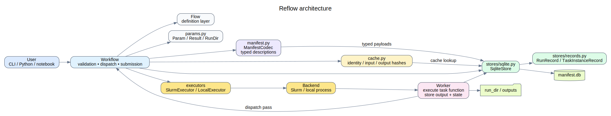
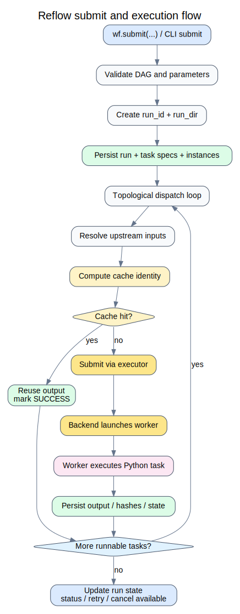

# Architecture

At a high level, the project is split into four concerns.

## 1. Definition

`Flow` and task decorators define the workflow graph.

## 2. Orchestration

`Workflow` validates the graph, resolves dependencies, decides what can run, and
coordinates cache lookup and backend submission.

## 3. Persistence

`SqliteStore` stores runs, task specs, task instances, states, outputs, and
cache metadata.

## 4. Execution backends

Executors translate runnable work into real execution.

## Component view

## Submit / execution flow

## Typical runtime path

1. `Workflow.submit()` creates a run
2. task specs and instances are persisted
3. dispatch checks dependency readiness
4. cache is consulted
5. runnable work is submitted through the executor
6. worker execution updates task state and outputs
7. run status is aggregated from stored task states

## Future direction

The current codebase already points toward a future service-backed deployment:

- stronger persistence models
- additional backends
- authenticated users
- web-based run inspection and control
- a proper database behind the manifest store
